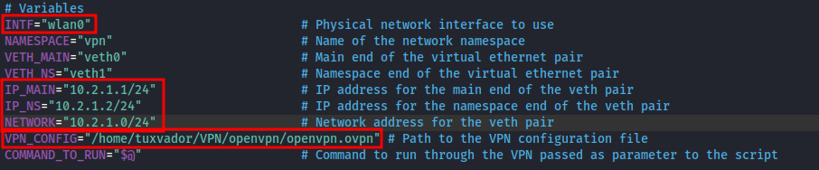

# PROC-VPN
A simple script to launch a vpn in a process using the linux network namespaces to isolate the process network from
from the rest of the computer. This way, when connecting to a VPN, instead of all the network traffic going throught the
VPN only the network traffic of the VPN goes throught the VPN. 

In this example, i use openvpn but wireguard, tailscale or any other vpn protocol can be used to achive the same result.
Depending on your configuration, if your internet traffic is going throught wifi ot ethernet, you will need to change **INTF**
If you want to change the ips of the virtual interface cretaed for the network namespace, you will need to change **IP_MAIN, IP_NS, NETWORK**
To finish, you will need to change the path to your openvpn configuration file by editing : **VPN_CONFIG**

⚠️ make sure to verify your vpn configuration works before trying to use it in the script.

